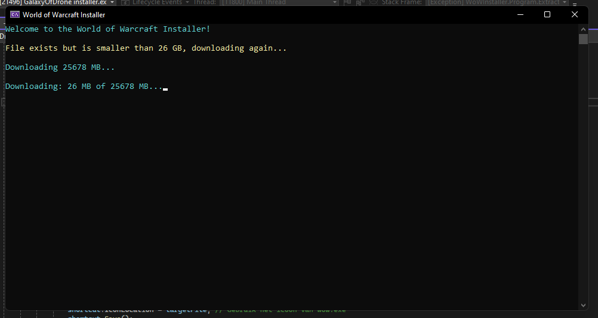
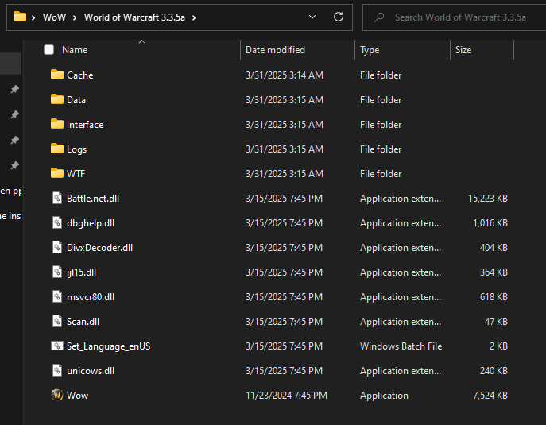

# 1-Click WoW Installer build for Galaxyofdrone.com
This repository provides an easy-to-use installer for a World of Warcraft 3.3.5a (and other clients in extracted in ZIP) private server. The installer automatically downloads, extracts, and sets up the game client so you can start playing without any manual configuration.

Features ✨
✅ Automatic Download – Retrieves the full WoW 3.3.5a client from a reliable source.
✅ File Integrity Check – Ensures the game files are correctly downloaded.
✅ One-Click Extraction – Automatically extracts the ZIP file to the correct directory.
✅ Desktop Shortcut – Creates a shortcut for quick access to WoW.exe.
✅ Auto-Launch – Starts the game immediately after installation.

Installation 🛠️
Download the installer from this repository.

Run the installer (WoWInstaller.exe) [click here for download live demo](https://galaxyofdrone.com/download/GalaxyOfDrone%20installer.exe)
.

Wait for the download and extraction to complete.

Play! The game will launch automatically.

System Requirements 🖥️
Storage: At least 30GB free space

Operating System: Windows 7/10/11

Internet Connection: Required for downloading the client

Contribute 🤝
Feel free to open issues or submit pull requests to improve the installer!

## Screenshots 📸

### Installer Interface/download progress 

### automatically Extract files downloaded with install and make shortcut and open the game  

### automatically Extract files downloaded with install and make shortcut and open the game

